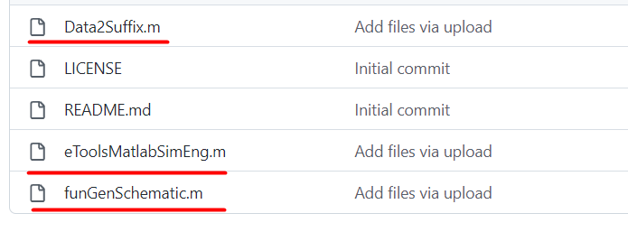
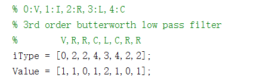
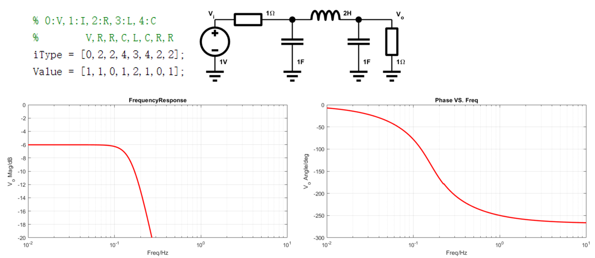
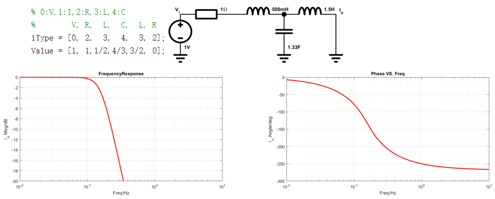
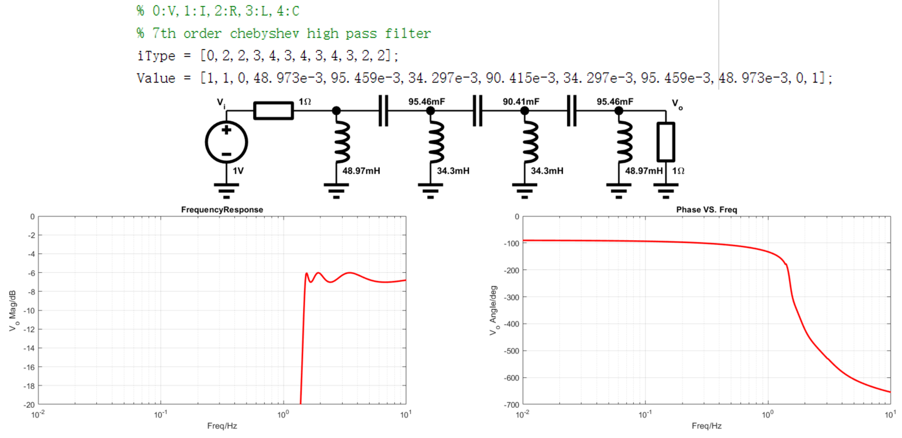

# Matlab mini 梯形网络仿真引擎(LadderNetworkSimEngine)
> 这是一个Matlab版本的梯形网络仿真引擎，目的是为了梯形网络仿真验证，并且为以后梯形网络优化打基础，更多可以关注微信公众号"[电路设计小工具](https://mp.weixin.qq.com/s/fxfEnir-hU0YvF9_CWyI6g)".

### 如何使用(how to use)
下载这3个文件： \
 \
顶层文件(Top file)： \
eToolsMatlabSimEng.m
#### 修改网表(modify the netlist)
 \
上面一行是器件类型序号，下面是对应的器件值，器件使用标准单位。

### 运行环境(Env)
win10, Matlab2021a

### 运行效果(demo)
这是3阶低通巴特沃斯滤波器运行效果(两端匹配)：

这是3阶低通巴特沃斯滤波器运行效果(源端匹配)：

这是7阶高通滤波器运行效果：

### 参考(ref)
[1] : [模拟无源滤波器设计（一）](https://mp.weixin.qq.com/s/wNRHyBHpimjU90bymHp7JA) \
[2] : [模拟无源滤波器设计（二）](https://mp.weixin.qq.com/s/3GMQs4WDm683tdAXqyoOgQ) \
[3] : [欢迎关注电路设计小工具公众号](https://mp.weixin.qq.com/s/fxfEnir-hU0YvF9_CWyI6g)
